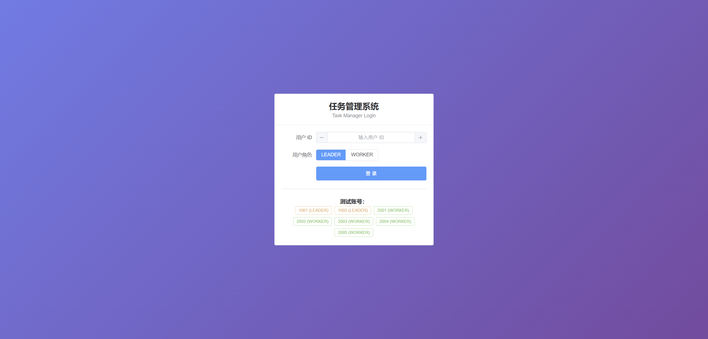
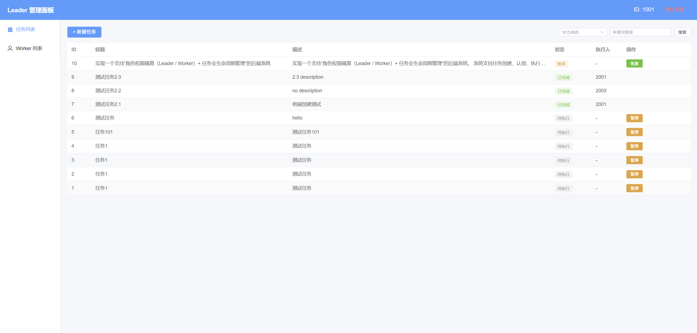
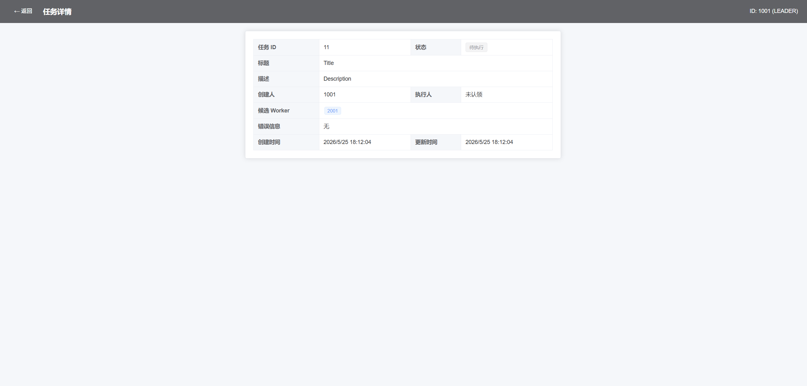
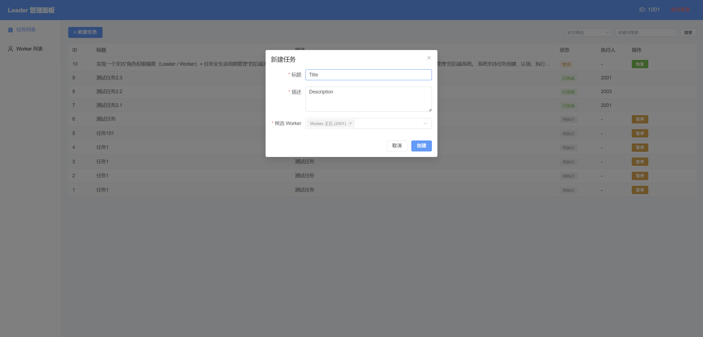
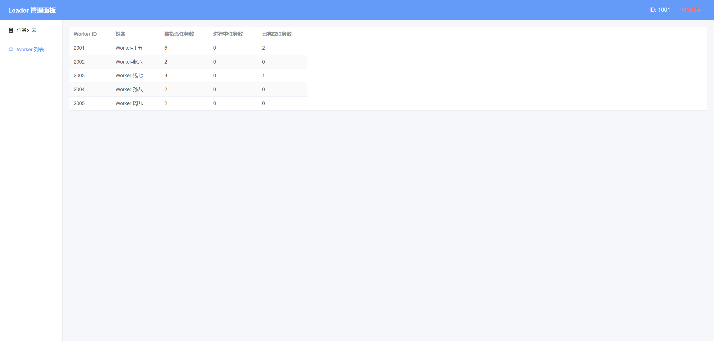
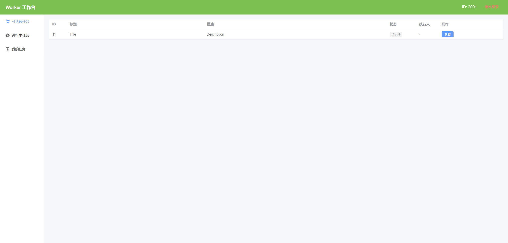
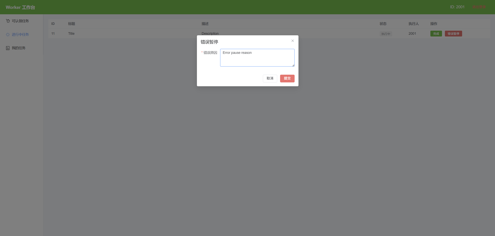
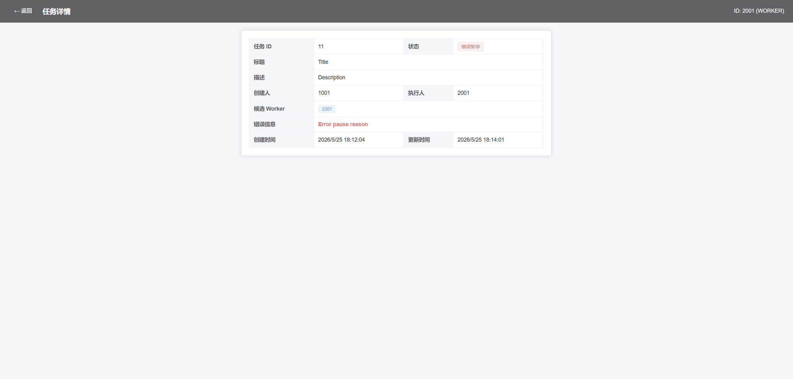

# 任务管理系统 (Task-Manager) 项目文档

## 一、项目概述

本项目实现了一个支持“角色权限隔离（Leader / Worker）+ 任务全生命周期管理”的全栈系统。

系统支持任务创建、认领、执行、暂停、恢复及错误处理，并提供两种存储方式：

- 内存存储（快速开发 / 测试）
- 数据库存储（MySQL + JdbcTemplate）

设计重点在于：高内聚、低耦合、易扩展；设计满足单一职责原则 SRP、开闭原则 OCP。

**后端技术栈**：Java, Spring Boot, Spring JDBC, MySQL/H2, Lombok, Postman

**前端技术栈**：Vue 3, Vite, Vue Router 4, Axios, Element Plus

## 二、项目结构

### 2.1 后端结构

项目后端采用分层架构设计，严格遵循单一职责原则 SRP，确保各层级逻辑清晰：

```
task-manager
├── src/main/java/com/example/taskmanager
│   ├── TaskManagerApplication.java       // 应用启动类
│   ├── common                            // 通用组件
│   │   ├── AuthInterceptor.java          // 解析请求头并校验角色访问路径
│   │   ├── Result.java                   // 统一响应格式
│   │   ├── ResultCode.java               // 错误码字典
│   │   └── UserContext.java              // 当前用户上下文（基于ThreadLocal）
│   ├── config
│   │   └── WebConfig.java                // 注册拦截器
│   │   ├── StorageProperties.java        // 配置类
│   ├── controller                        // 控制器层
│   │   ├── CommonController.java         // 通用接口控制器
│   │   ├── LeaderController.java         // 管理员（负责人）接口控制器
│   │   └── WorkerController.java         // 普通工作者接口控制器
│   ├── entity                            // 领域实体
│   │   ├── Role.java                     // 角色枚举
│   │   ├── Task.java                     // 任务实体
│   │   ├── TaskStatus.java               // 任务状态枚举
│   │   └── User.java                     // 用户实体
│   ├── exception                         // 异常处理
│   │   ├── BusinessException.java        // 自定义业务异常
│   │   └── GlobalExceptionHandler.java   // 全局异常处理器（转换异常为标准JSON响应）
│   ├── repository                        // 仓储层（数据访问）
│   │   ├── TaskRepository.java           // 任务存储抽象接口
│   │   ├── impl
│   │   │   ├── DbTaskRepositoryImpl.java // MySQL实现
│   │   │   └── MemoryTaskRepositoryImpl.java // HashMap内存实现
│   │   └── UserRepository.java           // 用户仓储接口
│   └── service                           // 服务层（业务逻辑）
│       ├── TaskService.java              // 任务服务接口
│       └── impl
│           └── TaskServiceImpl.java      // 核心状态机与业务逻辑实现
├── src/main/resources
│   ├── application.yml                   // 应用配置与存储方式切换
│   └── schema.sql                        // 数据库初始化脚本
└── pom.xml                               // 项目依赖配置
```

### 2.2 前端结构

```
task-manager/frontend/
├── index.html
├── vite.config.js           // Vite 配置（含 /api 代理）
├── package.json
└── src/
    ├── main.js              // 入口：挂载 ElementPlus + Router
    ├── App.vue              // 根组件，仅 <router-view />
    ├── style.css            // 全局样式（极简）
    ├── api/
    │   └── index.js         // Axios 实例 + 请求/响应拦截器 + 全部 API 函数
    ├── router/
    │   └── index.js         // 路由配置 + beforeEnter 守卫
    └── pages/
        ├── LoginPage.vue    // 登录页
        ├── LeaderPage.vue   // Leader 管理面板（任务列表 + Worker 列表）
        ├── WorkerPage.vue   // Worker 工作台（可认领/进行中/我的任务）
        └── TaskDetailPage.vue // 任务详情页
```

## 三、API 设计

API 设计遵循 RESTful 规范，并根据角色（Leader/Worker）进行了物理路径隔离，便于配置不同的安全策略。

| **模块**   | **路径**                             | **方法** | **功能描述**                 |
| ---------- | ------------------------------------ | -------- | ---------------------------- |
| **Leader** | `/api/leader/task`                   | POST     | 创建新任务并指定候选人列表   |
|            | `/api/leader/tasks/{id}/pause`       | POST     | 强制暂停任务                 |
|            | `/api/leader/tasks/{id}/resume`      | POST     | 恢复已暂停的任务             |
|            | `/api/leader/workers`                | GET      | 查看 Worker 列表             |
| **Worker** | `/api/worker/tasks?type=`            | GET      | 查看任务列表                 |
|            | `/api/worker/tasks/{id}/claim`       | POST     | 认领任务（状态转为执行中）   |
|            | `/api/worker/tasks/{id}/finish`      | POST     | 提交并完成任务               |
|            | `/api/worker/tasks/{id}/error-pause` | POST     | 错误暂停任务                 |
| **公共**   | `/api/tasks/{id}`                    | GET      | 查询任务详情（包含状态追踪） |

所有请求需携带 Header：

```
X-User-Id: 1
X-User-Role: LEADER / WORKER
```

## 四、数据库表设计

系统核心表结构如下。

### 4.1 任务主表 (task)

| **字段名**    | **类型**  | **说明**                                 |
| ------------- | --------- | ---------------------------------------- |
| id            | BIGINT    | 主键，自增                               |
| title         | VARCHAR   | 任务标题                                 |
| description   | VARCHAR   | 任务描述                                 |
| status        | VARCHAR   | 枚举：PENDING, IN_PROGRESS, PAUSED, etc. |
| creator_id    | BIGINT    | 任务创建者 ID (Leader)                   |
| assignee_id   | BIGINT    | 当前负责人 ID (Worker)                   |
| error_message | VARCHAR   | 任务错误信息                             |
| created_at    | TIMESTAMP | 任务创建时间                             |
| updated_at    | TIMESTAMP | 任务状态更新时间                         |
| version       | INT       | 乐观锁版本号，防止并发冲突               |

### 4.2 任务-候选工作者关联表 (task_candidate_worker)

| **字段名** | **类型** | **说明**       |
| ---------- | -------- | -------------- |
| id         | BIGINT   | 主键，自增     |
| task_id    | BIGINT   | 任务关联 ID    |
| worker_id  | BIGINT   | 候选 Worker ID |

### 4.3 用户表 (user)

| **字段名** | **类型**  | **说明**               |
| ---------- | --------- | ---------------------- |
| id         | BIGINT    | 主键，自增             |
| name       | VARCHAR   | 姓名                   |
| role       | VARCHAR   | 角色（LEADER / WORKER) |
| created_at | TIMESTAMP | 创建时间               |
| updated_at | TIMESTAMP | 更新时间               |

## 五、前后端连接方式

### 5.1 跨域解决方案

采用 **Vite 开发代理**：

```js
// vite.config.js
server: {
  proxy: {
    '/api': {
      target: 'http://localhost:8080',
      changeOrigin: true,
    },
  },
}
```

前端请求 `/api/...` 时，Vite 开发服务器会自动转发到后端 `localhost:8080`，浏览器端无跨域问题。同时后端也配置了 `CorsConfig`，直接访问同样可用。

### 5.2 Axios 拦截器

```js
// 请求拦截：自动注入身份头
api.interceptors.request.use((config) => {
  const user = JSON.parse(localStorage.getItem('user') || 'null')
  if (user) {
    config.headers['X-User-Id'] = user.userId
    config.headers['X-User-Role'] = user.role
  }
  return config
})

// 响应拦截：统一处理业务错误码
api.interceptors.response.use((res) => {
  if (res.data.code !== 0) {
    ElMessage.error(res.data.message)  // 自动弹出错误提示
    return Promise.reject(res.data)
  }
  return res.data
})
```

所有页面调用 API 时无需重复处理错误，拦截器统一展示后端返回的错误信息。

### 5.3 登录与身份持久化

- 前端通过 `POST /api/login` 携带 `{ userId, role }` 调用后端验证
- 后端检查用户是否存在、角色是否匹配
- 登录成功后将 `{ userId, role }` 存入 `localStorage`
- 页面刷新后 Axios 拦截器从 `localStorage` 读取身份，自动附带到每次请求
- 退出登录时清除 `localStorage` 并跳转回登录页

## 六、页面与交互设计

### 6.1 登录页面 (`/login`)

**布局**：居中卡片式表单，渐变背景。

**控件**：

- 用户 ID 数字输入框（范围 1001-9999）
- 角色单选按钮组（LEADER / WORKER）
- 登录按钮

**交互细节**：

- 页面底部提供**测试账号标签**，点击即可快速填入 ID 和角色
- 登录失败时，响应拦截器自动弹出错误提示（如"用户角色不匹配"）
- 登录成功后根据角色自动跳转到 `/leader` 或 `/worker`



### 6.2 Leader 页面 (`/leader`)

**布局**：顶栏 + 左侧菜单 + 右侧内容区（经典后台管理布局）。

**左侧菜单**：两个 Tab 切换

- **任务列表**：展示所有任务表格
- **Worker 列表**：展示所有 Worker 统计信息

**任务列表功能**：

- 表格列：ID、标题、描述、状态（彩色标签）、执行人
- **筛选栏**：状态下拉 + 关键词输入 + 搜索按钮
- **操作列**：
  - PENDING/IN_PROGRESS 状态显示「暂停」按钮
  - PAUSED/ERROR_PAUSED 状态显示「恢复」按钮
- 点击行任意位置跳转到任务详情页
- 空列表显示"暂无任务"占位





**新建任务**：

- 点击「+ 新建任务」弹出对话框
- 填写标题（文本输入）、描述（多行文本）、候选 Worker（多选下拉，选项来自 Worker 列表）
- 创建成功后自动刷新任务列表



**Worker 列表**：

- 表格列：Worker ID、姓名、被指派任务数、进行中任务数、已完成任务数



### 6.3 Worker 页面 (`/worker`)

**布局**：与 Leader 一致（顶栏 + 左侧菜单 + 内容区），顶栏颜色区分角色。

**左侧菜单**：三个 Tab

- **可认领任务** (`claimable`)：状态为 PENDING 且自己在候选列表中
- **进行中任务** (`processing`)：当前由自己认领且执行中的任务
- **我的任务** (`assigned`)：所有自己被指派的任务

**操作按钮**（根据 Tab 动态显示）：

- 可认领列表：「认领」按钮
- 进行中列表：「完成」按钮 + 「错误暂停」按钮



**错误暂停交互**：

- 点击「错误暂停」弹出对话框
- 必须填写错误原因（多行文本）
- 提交后调用 `POST /api/worker/tasks/{id}/error-pause`



### 6.4 任务详情页 (`/task/:id`)

**布局**：顶栏（含返回按钮）+ 居中卡片。

**展示内容**：

- 使用 Element Plus 的 `Descriptions` 组件展示所有字段
- 任务 ID、状态（彩色标签）、标题、描述
- 创建人、执行人（未认领显示"未认领"）
- 候选 Worker 列表（标签形式）
- 错误信息（红色高亮）
- 创建时间、更新时间（本地化格式）

**角色差异**：

- Leader 可查看任意任务
- Worker 只能查看自己在候选列表中或已认领的任务（后端权限校验）



## 七、路由与鉴权

```js
routes: [
  { path: '/', redirect: '/login' },
  { path: '/login' },
  { path: '/leader',  meta: { requiresAuth: true, role: 'LEADER' } },
  { path: '/worker',  meta: { requiresAuth: true, role: 'WORKER' } },
  { path: '/task/:id', meta: { requiresAuth: true } },
]
```

路由守卫逻辑：

1. 无需认证的页面直接放行
2. 需要认证但未登录 → 跳转 `/login`
3. 已登录但角色不匹配 → 跳转到对应角色的首页

## 八、运行说明

### 8.1 环境要求

| 依赖    | 版本要求                       |
| ------- | ------------------------------ |
| JDK     | 21+                            |
| Node.js | 18+                            |
| npm     | 9+                             |
| MySQL   | 8.0+（仅使用数据库存储时需要） |

### 8.2 启动步骤

**1.克隆代码并进入项目根目录。**

**2.配置数据库（默认使用 Memory 模式）：**

- 在 `src/main/resources/application.yml` 中修改 `storage.type: db`。

- 配置 `spring.datasource` 下的 URL、用户名和密码。
- 创建数据库：`CREATE DATABASE task_db;`
- 在数据库中创建表：运行 `schema.sql` 文件以初始化数据库结构。
  - 进入 MySQL， 切换到目标数据库 `task_db`。
  - 运行脚本：`SOURCE .../task-manager/src/main/resources/schema.sql;`

**3.启动后端**

```bash
cd task-manager

# 方式一：Maven 直接启动（内存存储，无需数据库）
./mvnw spring-boot:run

# 方式二：如需数据库存储，先修改 src/main/resources/application.yml
#   storage.type: db
# 确保 MySQL 运行在 localhost:3306，数据库 task_db 已创建
# 然后执行 ./mvnw spring-boot:run
```

后端启动后监听 `http://localhost:8080`。

**4.启动前端**

```bash
cd task-manager/frontend

# 安装依赖（首次）
npm install

# 启动开发服务器
npm run dev
```

前端启动后访问 `http://localhost:5173`。

### 8.3 测试账号

| 用户 ID | 角色   | 姓名        |
| ------- | ------ | ----------- |
| 1001    | LEADER | Leader-张三 |
| 1002    | LEADER | Leader-李四 |
| 2001    | WORKER | Worker-王五 |
| 2002    | WORKER | Worker-赵六 |
| 2003    | WORKER | Worker-钱七 |
| 2004    | WORKER | Worker-孙八 |
| 2005    | WORKER | Worker-周九 |

登录页面底部的测试账号标签支持一键填入。